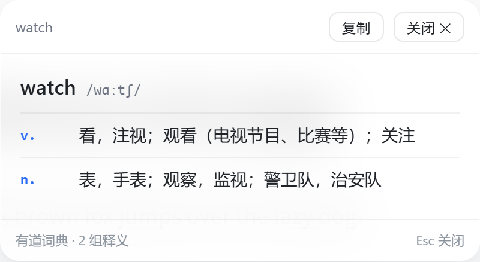

# 划词翻译 · PDF 版（Edge / Chrome 扩展，Manifest V3）

双击选中英文 → 立即出中文浮窗；右键菜单 / `Alt+T` 也能翻。
自带一个基于 pdf.js 的 **PDF 阅读器页面**，本地 PDF 拖进去就能像网页一样划词翻译。
**图片、扫描件、视频字幕里的文字**（选不中的那些）用 `Alt+S` 框选截屏，OCR 后再翻。

---

## 一、安装（Edge）

1. 打开 Edge，地址栏输入 `edge://extensions/`，回车。
2. 打开左下角（或右侧）的 **开发人员模式**。
3. 点 **加载解压缩的扩展**，选择本文件夹（克隆 / 解压出来的那个目录）。
4. 安装后会自动打开设置页；如果没打开，点扩展图标 →「设置」。

> Chrome 同样步骤，用 `chrome://extensions/`。
> 更新代码后，回到扩展页点该扩展的「重新加载」按钮即可。

## 二、配置翻译引擎（首选：Cloudflare Workers AI 代理）

本机实测**直连 `translate.googleapis.com` 不通**（8 秒无响应），Cloudflare 的出口 IP 也长期被 Google 429，
所以默认第一个引擎走自建代理 —— 而这个代理现在**直接调用 Workers AI 翻译，不再经过 Google**。
设置页 →「自建代理」里填：

**语言默认是「自动（中英互译）」**：原文像中文就译成英文，否则译成简体中文，来回翻不用手动切。
也可以在设置页 / 弹窗 / 翻译窗口里直接指定任意目标语言（英日韩法德西俄葡意阿泰越印尼）。

| 项目 | 值 |
| --- | --- |
| 代理地址 | `https://<你的域名>/translate`（Cloudflare Workers；**默认留空**，按第七节部署后自己填） |
| Token | 你自己设的那个（新部署的话重新生成一个） |

点 **测试** 出现 `✓`，再点 **保存**（保存时会弹一次该域名的访问授权，点**允许**）。
服务端怎么部署/维护看第七节。

备用引擎（按顺序自动回退，顺序可用 ↑↓ 调整）：

1. **AI 接口**（OpenAI 兼容，任意一家都行）

   | 项目 | 示例（DeepSeek） |
   | --- | --- |
   | Base URL | `https://api.deepseek.com/v1` |
   | API Key | `sk-你的key` |
   | 模型 | `deepseek-chat` |

2. **Google 直连**：免费、无需配置，但**国内网络通常连不上**（实测 8s 超时），只在代理也挂了的时候兜底。
3. **有道智云**：填应用 ID 和应用密钥（需注册）。

## 三、使用方式

### 1. 普通网页（http / https）

- **双击**选中单词或短语 → 浮窗出译文
- 选中后 **右键 →「翻译选中文本（划词翻译）」**
- 选中后按 **`Alt+T`**
- 浮窗可拖动、可复制译文、`Esc` 或点空白处关闭

**双击单个英文单词时出的是「词典视图」——按词性列出多个意思**（而不是笼统的一句话翻译）。
**双击、`Alt+T`、右键菜单三个入口都一样**：单词 → 词典，短语/句子 → 翻译引擎。

```
watch  /wɑːtʃ/
v.  看，注视；观看（电视节目、比赛等）；关注
n.  表，手表；观察，监视；警卫队，治安队
```



- 数据来自**有道词典的英汉词库**（不是 AI 现编的）：一个 GET 请求、约 1.4 KB、**实测 18~27 ms**，
  同一个词第二次点几乎瞬间出（background 里有缓存）。
- 优先用真词典是因为试过让 Workers AI 现编词性+释义：小模型（llama-3.1-8b-fast，约 600 ms）
  会把 `watch` 的名词义给成"视频 / 时钟 / 电视"，给不出"表"；准的 qwen3-30B 要 4.6~8 s。
- **多词短语、句子、中文一律走原来的翻译引擎**，不是词典视图；词典里没有收录的词
  （人名、生造词、`asdfghjkl` 这种）会自动退回翻译引擎，**不会报错、也不会卡住**。
- 全大写保留原样查询（`US` → abbr. 美国；转成小写就变成"我们"了）。

### 2. 翻译窗口（可多开）

点扩展图标 →「＋窗口」，会打开一个独立标签页：左边原文、右边译文，
`Ctrl+Enter` 翻译，结果可一键复制。**可以点多次，同时开好几个窗口**，各自独立。

### 3. 本地 PDF —— 用插件自带的阅读器（**推荐**）

点扩展图标 →「＋PDF」（或 `Alt+R`，或右键菜单里的同名项），
**点窗口中央的大框**选择 PDF，也可以直接把文件拖进去。在阅读器里：

- 划选文本 / 双击单词 → 和网页一样出翻译
- 支持翻页、缩放、适应宽度、跨页滚动（页面是懒渲染的，几百页也不卡）

**为什么不用 Edge 自带的 PDF 阅读器？** 那是浏览器内置页面（`chrome-extension://…`），
Chrome/Edge 的安全模型不允许任何第三方扩展往里注入脚本，所以在那儿做不到划词翻译。
自带阅读器就是为了绕开这个限制。

### 4. 截屏翻译（图片 / 扫描件 / 视频字幕里选不中的文字）

按 **`Alt+S`**，或右键菜单 →「截屏翻译（框选区域）」，或点扩展图标 →「截屏」：

1. 当前页会被**冻结成一张截图**（在浮层出现之前截，所以浮层不会被截进去）
2. 拖一个框罩住要翻的文字，松手；`Esc` 或右键取消
3. 框内文字走自建代理做 OCR，识别结果再走正常翻译链路，译文从浮窗出来

几个细节：

- 框太小（< 12px）当"点了一下"，直接取消，不会拿空白图去识别
- 裁剪时按截图与视口的比例换算（浏览器缩放、高 DPI 屏都对得上）
- 长边大于 1280px 会先缩小再上传，长边小于 320px 会放大 2 倍（小字更容易识别）
- OCR 是**在自建代理上用 Workers AI 视觉模型**做的，没往扩展里塞 20MB 的 tesseract 语言包
- 识别不出文字时提示「没识别到文字，试试框大一点或放大页面」

### 5. Edge 自带 PDF 阅读器里的兜底

如果你就是想用它：在 PDF 里选中文本按 **`Ctrl+C`**，然后点扩展图标，
弹窗会自动读取剪贴板并翻译（`esc` 关掉再点一次也行）。若弹窗没自动读，
点弹窗里的「粘贴剪贴板」按钮。

## 四、已知限制

| 限制 | 说明 |
| --- | --- |
| 无法在 Edge 内置 PDF 阅读器划词 | 浏览器不允许扩展注入其内置页面，只能用上面第 5 条兜底（但**截屏翻译在它上面能用**：`Alt+S` 框选就行） |
| 无法在 `edge://`、扩展商店等页面工作 | 同上，浏览器保护页面（截屏翻译也截不了这些页） |
| 文本上限 | 单次 8000 字符；Google 引擎按 1500 字符自动分块请求；代理（Workers AI）单次 4000 字符 |
| 不是「整篇文档翻译」 | 只翻你选中的部分 |
| 扫描版 PDF / 图片里的文字 | 用**截屏翻译**（`Alt+S` 框选）——那是图像，没有文字层，选不中 |
| 双击单个单词给的是词典释义，不是整句翻译 | 这是刻意的：单词就按**一词多义**列出来（见第三节第 1 条）。想要"整句风格"的翻译，就多选几个词；选中的是短语/句子时一定走翻译引擎 |
| 截屏翻译依赖自建代理 | OCR 跑在 Cloudflare Workers AI 上，代理挂了 / 没填 token 就识别不了（会明确报错，不会静默失败） |

### 常见问题

| 现象 | 原因与解决 |
| --- | --- |
| 点「设置」弹出的是**一个小小的设置窗口** | `manifest.json` 里 `options_ui.open_in_tab` 必须是 `true`。写成 `open_in_new_tab` 会被浏览器**静默忽略**，于是退回默认行为——在扩展管理页里塞一个小对话框，内容被挤成一团。改完到扩展页点「重新加载」 |
| 普通网页双击报 `翻译失败 · Extension context invalidated.`，但 PDF 阅读器里却正常 | 扩展刚被**重新加载 / 更新**过，那个网页里注入的旧脚本已经成了孤儿：双击照样触发、浮窗照样弹，但它手里的 `chrome.runtime` 已断连，任何消息都发不出去。**刷新该网页（F5 / Ctrl+R）即可恢复**，这是唯一办法——扩展只有 `activeTab`（按用户手势逐次授予），后台拿不到站点 host 权限，没法远程重新注入（实测 `chrome.scripting.executeScript` 会报 `Cannot access contents of the page`）。PDF 阅读器是扩展自己的页面，每次打开都是全新加载，所以不受影响。**开发时每点一次「重新加载」，已经开着的网页都要刷一遍** |

## 五、代码结构

```
manifest.json              MV3 清单：权限、右键菜单、快捷键、注入规则
src/background.js          service worker：右键菜单、快捷键、翻译请求中转、消息路由
src/content.js             网页注入：双击/选中监听、与浮窗通信
src/ui/panel.js            翻译浮窗（Shadow DOM，样式与页面隔离，网页和阅读器共用）
src/ui/snip.js             截屏翻译：冻结截图浮层、拖框、裁剪（含缩放/DPI 换算）、OCR 编排
src/snip-bootstrap.js      content script 没注入时用的动态注入入口（executeScript 加载它）
src/lib/engines.js         四个翻译引擎 + 超时 + 自动回退 + 语种判定 + AI 多账号 + OCR 调用
src/lib/dict.js            单词多义：有道词典 jsonapi 解析（只取 ec 英汉）+ 缓存 + 格式化
src/lib/store.js           设置读写（chrome.storage.sync）
src/popup.html/css/js      点图标的小弹窗：手输翻译、读剪贴板、开窗口/阅读器/设置
src/window.html/css/js     独立翻译窗口（可多开）：左右分栏、Ctrl+Enter、一键复制
src/options.html/css/js    设置页：语言、引擎、AI 多账号、行为开关
src/reader.html/css/js     内置 PDF 阅读器（pdf.js + 自写文本层，文本可选中）
src/result.html/js         兜底结果页（页面不可注入时显示译文）
vendor/pdfjs/              pdf.js 4.10.38（legacy 构建）+ cmaps + 标准字体
icons/                     扩展图标
worker/                    Cloudflare Workers 版翻译代理（推荐，免费，Workers AI 直译）
deploy/                    VPS 版翻译代理（python + systemd + nginx 片段）
tests/                     测试脚本（见第六节）
```

想改翻译行为：

- 换提示词 / 加语言：`src/lib/engines.js`
- 浮窗样式：`src/ui/panel.js` 顶部的 `CSS` 常量
- 毛玻璃观感：`popup.css` / `window.css` / `options.css` / `reader.css` 里的 `.glass` 类
- AI 账号列表与切换：`src/options.js` 的 `renderAccounts` / `syncOpenaiFromActive`
- 设置页整体大小：`options.css` 的 body 字号 / `.wrap` 宽度；右上角「界面缩放」存 `settings.uiScale`（写在 `<html>` 的 `zoom` 上）
- 双击自动翻译的开关：设置页，或 `content.js` 里的 `settings.autoOnDblclick`

## 六、复跑测试（可选）

脚本都在 `tests/`，用本机已有的 Node 22 直接跑，无需安装任何依赖（不用 Playwright）：

```bash
node tests/test-engines.mjs   # 引擎逻辑单测（离线，mock fetch，44 项）
node tests/test-worker.mjs    # Cloudflare Worker 逻辑单测（离线，mock fetch/AI/cache，52 项）
node tests/test-dict.mjs      # 单词多义解析单测（离线，用真实抓下来的 fixture，53 项）
node tests/e2e.cjs            # 真实 Edge + 真实扩展：PDF 阅读器端到端
node tests/e2e-web.cjs        # 真实 Edge + 真实扩展：网页划词端到端
node tests/e2e-dict.cjs       # 真实 Edge + 真实扩展 + 真实有道接口：词典视图端到端
node tests/e2e-snip.cjs       # 真实 Edge + 真实扩展 + 本地 mock 代理：截屏翻译端到端
node tests/e2e-window.cjs     # 真实 Edge：翻译窗口 / AI 多账号 / 设置页布局对齐 / 阅读器大框可点击
python tests/mkpdf.py         # 需要时重新生成 tests/sample.pdf
node tests/shot.cjs options.html 1280 1700   # 给扩展页面截图，肉眼检查 UI（临时调试用）

# 真实网络 + 真实线上代理（地址与 token 都不入库，用环境变量传）：
ST_PROXY_URL=https://你的域名/translate ST_PROXY_TOKEN=你的token node tests/e2e-proxy.cjs
```

e2e 会自动启动 headless Edge、加载本目录的扩展、跑完自动关闭并清理临时 profile。
**一次只跑一个 e2e**（它们各自占端口 + 临时 profile，串着跑最稳）。

> `e2e-snip.cjs` 里的截图这一步是**真实调用失败**的：headless 里没有"用户手势"，
> 拿不到 `activeTab`（实测 `chrome.permissions.request` 会直接挂起），所以那段只断言
> 「失败提示可读、会自己消失」；后半程用一张注入的图跑通
> 框选 → 裁剪 → `/ocr` → `/translate` → 浮窗 的全链路（本地 mock 代理，不烧 neuron）。

> **踩过的坑：headless 里"PDF 画布全白"的真凶是标签不在前台，别急着改断言。**
> pdf.js 的渲染是 `requestAnimationFrame` 驱动的；`--headless=new` 里只要这个标签不是前台，
> `document.visibilityState` 就是 `hidden`，rAF 不再跑 → `page.render().promise` 永不 resolve
> （`window.__stReader.state().rendered` 一直是空，25 s 后触发阅读器自己的"画布渲染超时"），
> 此时 canvas 尺寸正常、画面看着也是好的，但 `getImageData` / `toDataURL` 读回**全白**。
> 本机最常见的触发源是 `onInstalled` 里 `chrome.tabs.create()` 开的设置欢迎页抢走前台。
> 所以 `e2e.cjs` 在断言画布像素**之前**会重新 `Target.activateTarget` + `Page.bringToFront`、
> 确认 `visibilityState === "visible"`，再轮询等 `dark > 500`（诊断脚本留在 `tests/tmp-canvas.cjs`）。
> 顺带记一笔排查方法：**用"把 `panel.js` 换成空壳再跑同一个探针"做对照实验**，
> 能一眼确认"这个失败到底是不是我刚改的代码引起的"。

**交付时的实测结论（全部通过）**

| 测试 | 结果 | 覆盖内容 |
| --- | --- | --- |
| `tests/test-worker.mjs` | **52 / 52** | Worker：主模型命中、回退链、m2m 兜底与语种映射、AI_MODEL 覆盖、输出清洗、空结果回退、鉴权与边界、/debug 与 compare、**/ocr 主模型与视觉入参、OCR 回退与空识别、图片格式/体积校验、AI_OCR_MODEL 覆盖、返回字段形状回归（`choices[].message.content` / `response` / `answer`，防止再出现"永远识别不到"）** |
| `tests/test-engines.mjs` | **44 / 44** | 代理引擎、Google 解析与格式异常、引擎回退、有道 SHA-256 签名、超长文本分块、自动中英对译、AI 多账号切换、**OCR 地址换算与请求体/错误透出** |
| `tests/test-dict.mjs` | **53 / 53** | 单词多义：什么算"查词"（单词/缩写/带撇号，句子与中文一律交给翻译）、**真实响应形状解析**（`i` 是 `"v. 看，注视；…"` 一条字符串，不是数组）、括号里的 `；` 不能切断、超长义项不留半截括号、人名条过滤、WHO 这类没有词性的缩略词兜底、缓存与大小写（`US` 不转小写）、查不到/HTTP 500/网络异常/非 JSON 一律返回 null 不抛 |
| `tests/e2e-snip.cjs` | **23 / 23** | 截屏翻译：无 activeTab 时的可读报错与自动消失、冻结截图浮层、拖框尺寸提示、裁剪出的 PNG 真的上传、OCR 文本进浮窗、`Esc`/右键取消、选完自动收起、无未捕获异常 |
| `tests/e2e-stale-context.cjs` | **13 / 13** | **扩展重新加载后"脚本已失效"（`Extension context invalidated`）**：正常双击、重新加载扩展、孤儿脚本必现报错、提示必须是「脚本已失效 + 去刷新」而不是「检查翻译引擎配置」、确认后台无法自动重新注入（缺站点 host 权限）、刷新后恢复 |
| `tests/e2e.cjs` | **17 / 17** | 扩展加载、PDF 解析、canvas 区域截图有可见内容、文本层、双击选词、浮窗内容（单词走词典视图）、关闭、无未捕获异常 |
| `tests/e2e-web.cjs` | **13 / 13** | content script 注入、双击选词、浮窗、关闭按钮、popup、options 渲染 |
| `tests/e2e-dict.cjs` | **22 / 22** | 词典视图端到端（**真实有道接口**）：双击 `watch` → 出 v./n. 两个词性、名词义里有"表"、动词义里有"看/注视"、显示音标与词典来源、**没有走翻译链**；选中两个词 → 不是词典视图、照常走翻译链；词库没有的词 → 退回翻译链不卡住；**右键菜单那条路**（background 组装好带 `dict` 的结果 → `show-translation`）也画成词典视图；**端到端耗时：首次约 0.24~1.0s（含 DNS/TLS 建连与 SW 冷启动）、缓存命中 5~8ms** |
| `tests/e2e-window.cjs` | **22 / 22** | 翻译窗口渲染与真实翻译、设置页 AI 多账号增删与切换、**设置页必须是独立标签页**（`options_ui.open_in_tab`）、**布局对齐与缩放**（输入框右边界一致 / 两列等宽 / 测试按钮位置统一 / 保存条不吸底 / 界面缩放 100·115·130·150% 立即生效）、阅读器中央大框可点击 |
| `tests/e2e-proxy.cjs` | **8 / 8**（需真 token） | 真实网络：网页双击**短语** `quick brown fox` → 线上代理 → 浮窗显示中文，来源标注「自建代理」。（必须选多词：单个词会被词典视图接走，不经过翻译引擎；没配 token 时跑另一条分支，只验报错可读，3/3） |

> e2e 里第二次双击那一步会把 `chrome.runtime.sendMessage` 临时替换成假译文，
> 用来单独验证「拿到译文之后」的浮窗渲染（因为本机连不上 Google，真实请求必定失败）。

## 七、翻译代理的服务端

### A. Cloudflare Workers AI（当前方案：免费，不碰 Google）

**链路**：插件 → `https://<你的域名>/translate`（Cloudflare 边缘）→ Worker → **Workers AI**。
**不再经过 Google**。原因是实测下来 Google 对 CF 的出口 IP 长期 429（欧洲 AMS 节点几乎必挂），
换端点、换 GET/POST、加重试都只是把失败率从 100% 降到「偶尔能成」，不值得继续投入。

**模型怎么选的**（兼顾质量与价格）：主模型 `@cf/qwen/qwen3-30b-a3b-fp8`。

| 模型 | 输入 neuron/M tokens | 输出 neuron/M tokens | 说明 |
| --- | --- | --- | --- |
| `@cf/qwen/qwen3-30b-a3b-fp8` | 4625 | 30475 | **主用**。30B 的 MoE，每次只激活 3B —— 单价和小模型持平，中英质量高一个量级 |
| `@cf/meta/llama-3.1-8b-instruct-fp8-fast` | 9625 | 38500 | 回退 1。快，中英一般 |
| `@cf/meta/llama-3.2-3b-instruct` | 4625 | 30475 | 回退 2。和小模型同价 |
| `@cf/meta/m2m100-1.2b` | — | — | 回退 3。专用翻译模型，不出彩但几乎不会挂 |

免费额度 **1 万 neuron/天**。一次划词按「原文 60 tokens + 译文 80 tokens」估：
约 `60×4625/1e6 + 80×30475/1e6 ≈ 2.7 neuron`，也就是**每天免费额度够翻三千多次划词**，
正常用根本用不完。超了才是 $0.011 / 1000 neuron。

代码在 `worker/`：`index.js`（纯 JS，可直接粘进控制台）、`wrangler.toml`、`.dev.vars.example`（本地开发模板；真的 `.dev.vars` 已进 `.gitignore`，不入库）。

**部署，方式一：控制台（不用装任何东西）**

1. Cloudflare → **Workers & Pages** → Create → Create Worker → 命名 `st-translate` → Deploy
2. Edit code，把 `worker/index.js` **整段替换**进去 → Deploy
3. Settings → Variables and Secrets → Add：`TOKEN`，类型选 **Secret（加密）**，值填一个新 token
   （本机生成：`python -c "import secrets;print(secrets.token_urlsafe(24))"`）
4. **绑定 Workers AI**（现在是主力，不是兜底）：Settings → Bindings → Add →
   Workers AI → 变量名必须填 `AI`（首次使用需在账户里接受 Workers AI 条款）
5. Settings → **Domains & Routes** → Add → Custom Domain → 你的域名
   （CF 会自动建 DNS 记录 + 签发证书，等状态变 Active）

**方式二：命令行**

```bash
cd worker
npx wrangler login
npx wrangler secret put TOKEN      # 粘贴新 token
npx wrangler deploy                # 再回控制台绑自定义域名
```

> ⚠️ **`npx wrangler deploy` 只会更新「你本机 wrangler 登录的那个账号」里的同名 Worker。**
> 如果线上那个 Worker 是**在控制台里手建、属于另一个 Cloudflare 账号**，本机怎么 deploy 都更新不到它
> （只会在你当前账号里另建一个同名 Worker）。这种情况请走**方式一**：整段粘贴 `worker/index.js` → Deploy。

> **必须绑自定义域名**：`*.workers.dev` 在国内访问不稳定，绑到自己的域名才稳。
> 前提是域名 DNS 托管在 Cloudflare —— 用自己的域名就行。

**部署后自检**

```bash
curl -X POST https://<你的域名>/translate -H "Content-Type: application/json" \
  -d '{"q":"Hello world","sl":"en","tl":"zh-CN","token":"你的token"}'
# 期望：{"ok":true,"translation":"你好，世界","detected":"en","engine":"qwen3-30b"}

curl "https://<你的域名>/healthz"     # 期望：{"ok":true,"service":"st-translate-worker"}

# 截屏翻译的 OCR 端点（image 必须是 png/jpeg 的 base64 data URI）
curl -X POST https://<你的域名>/ocr -H "Content-Type: application/json" \
  -d '{"image":"data:image/png;base64,<你的图>","token":"你的token"}'
# 期望：{"ok":true,"text":"图里的文字","engine":"qwen3.8-27b"}
# 没带 token / token 错 → {"ok":false,"error":"token 无效"}；没有 /ocr 路由 → {"ok":false,"error":"not found"}
```

**排查与挑模型**

```
https://<你的域名>/debug?token=<你的token>                       # 单次翻译 + trace
https://<你的域名>/debug?token=<你的token>&compare=1&q=...       # 同一句话跑遍 4 个模型
```

`/debug` 返回里看三样：`colo`（落在哪个 CF 机房）、`hasAI`（AI 是否真的绑上）、
`trace`（每个候选模型的成败与耗时）。`compare=1` 会给出 4 个模型的译文和毫秒数，
想换模型照着结果挑就行。

**换模型**：Settings → Variables → Add `AI_MODEL`，值填模型 ID，
例如 `@cf/meta/llama-3.1-8b-instruct-fp8-fast`。改完不用动代码，原模型仍在回退链里。

### 截屏翻译的 OCR（`/ocr`，与翻译同一套代理）

| 模型 | 输入/输出价格（$/M tokens） | 说明 |
| --- | --- | --- |
| `@cf/qwen/qwen3.8-27b` | 0.45 / 3.20 | **主用**。中英混排截图逐字准（900×360 实测 100%）；关掉思考块后 2.3–3.5s、约 45 neuron/次 |
| `@cf/meta/llama-4-scout-17b-16e-instruct` | 0.27 / 0.85 | 回退。2.2–6.3s、约 34 neuron/次，标点保真略逊于 qwen3.8 |

几个实测**不能用**的（别再换回去）：

| 模型 | 症状 |
| --- | --- |
| `@cf/moondream/moondream3.1-9B-A2B` | 文档齐全、官方定位就是 OCR，但实测对本机账号**恒返回 `{}`**（`success:true` 且 `result` 为空）。换小图 / 换公网 URL / 换 `task` 全都一样 → 用户只会看到"没识别到文字" |
| `@cf/llava-hf/llava-1.5-7b-hf` | 能返回，但会**擅自翻译**而不是转写（结果在 `description` 字段） |
| `@cf/google/gemma-4-26b-a4b-it` | 识别准确，但要 11.8s，推理 token 烧得厉害 |
| `@cf/zai-org/glm-5.3-flash` | 免费版 403 不可用 |
| `@cf/meta/llama-3.2-11b-vision-instruct` | 需先在控制台给该模型提交 `agree` 同意 Meta 协议，否则 403 |

- **免费额度够用吗**：OCR 比划词翻译贵得多——一张图约 **45 neuron**，1 万 neuron/天 ≈ **每天 220 次截屏识别**。
  划词翻译仍是约 2.7 neuron/次（三千多次/天）。两个共用同一份日额度。
- prompt 明确要求"原样提取、不翻译、保留换行、全角标点不许改成半角"，所以识别出来的中文不会先被翻成英文
- 图片不缓存（同一区域反复框选的收益太小，不值得存 base64）；翻译那一步照旧吃 24h 缓存
- 图片上限约 6.5MB（base64 9M 字符），超了返回 413；前端裁剪时已经先控制在 1280px 长边以内
- 全挂返回 502 且带 `trace`；两个模型都跑通但都没识别到文字时返回 `{ok:true,text:""}`，前端提示"没识别到文字"
- **换 OCR 模型**：Variables 加 `AI_OCR_MODEL`（值填模型 ID），原模型仍在回退链里
- **挑模型**：`POST /debug?ocr=1&compare=1` + body `{"image":"data:image/png;base64,...","token":"..."}`，会把两个视觉模型都跑一遍给你对比

> ⚠️ **最大的坑：模型返回的字段形状不统一，绝不能写死一个字段名。**
> 历史上 `runOcrModel` 只读 `out.response`（旧代码还读过 `out.result`），而
> `@cf/qwen/qwen3.8-27b` 的返回是 OpenAI 风格的 `choices[0].message.content`，
> moondream 走 `answer`，m2m100 走 `translated_text`，llava 走 `description`。
> 结果是**两个 OCR 模型全部被解析成空串**，线上表现就是"框了十次十次都说没识别到文字"——
> 模型其实跑得好好的。现在统一走 `pickText()` 兼容全部形状，`tests/test-worker.mjs` 的
> `[11f]` 组专门盯着这个回归。
>
> 排查手法：不要靠猜，直接拿真实截图打一遍模型看原始 JSON——
> `node worker/tmp/mkimg.cjs`（headless Edge 渲一张中英混排图）→
> `node worker/tmp/verify-ocr.mjs`（import 真实 worker 代码，把 `env.AI.run` 接到真实 Workers AI，
> 逐字比对识别结果）。

> 改完 `worker/index.js` 必须**重新部署**（控制台方式就是整段粘贴替换 → Deploy），
> 否则 `/ocr` 不存在——插件会明确报「not found」，不会静默失败。

**踩过的坑（别改回去）**：Qwen3 是推理模型，默认会先输出一大段 `<think>`。
token 预算给小了（原文×1.2+200 ≈ 253）的后果是**译文根本轮不到输出就被截断**，
实测 5 次里 4 次空手而归、全部回退到 llama。现在的对策是三管齐下：
预算给到 `max(512, 原文×2+768)`、用户消息末尾加 Qwen3 的 `<arg_key:6124c78e>` 软开关、
清洗时把 `<think>` 块和回显的 `<arg_key:6124c78e>` 都剥掉（剥完为空就视为失败继续回退）。

**其它行为**：

- 结果进 CF 缓存 24 小时，同一个词重复划不重复烧 neuron
- 单次上限 4000 字符；超了返回 413
- 浮窗底部会显示实际用的模型（`模型：qwen3-30b`），回退时也看得出来
- 某个模型返回空时，`/debug` 的 trace 里会带 `raw=` 片段，能看到它到底吐了什么

**插件侧怎么切**：设置页 →「自建代理」→ 地址填 `https://<你的域名>/translate`、
token 填新的 → 测试 → 保存（弹授权点允许）。

### B. VPS 版（可选：自己的服务器 + 域名）

**链路**：插件 → HTTPS `<你的域名>:8443/translate` → nginx（复用服务器上已有的站点与 Let's Encrypt 证书）
→ `127.0.0.1:8099` 的 `proxy.py` → POST `translate.googleapis.com` → 原路返回。
代理只监听 127.0.0.1，公网必须经过 nginx；不带 token 一律 401（实测过）。

| 线上文件 | 作用 |
| --- | --- |
| `/opt/gtranslate/proxy.py` | 代理服务，纯 Python 3 标准库，无第三方依赖，常驻约 18 MB |
| `/opt/gtranslate/token.txt` | token（权限 600） |
| `/etc/systemd/system/gtranslate.service` | systemd 单元，开机自启、崩溃自动重启 |
| nginx `location = /translate` | 反代到 8099，加在已有的 8443 server 块里 |

仓库 `deploy/` 下有同样三份文件，重装或换机器直接照搬。

**常用命令**

```bash
systemctl status gtranslate        # 状态
journalctl -u gtranslate -f        # 实时日志（每笔翻译带耗时）
systemctl restart gtranslate       # 改 token 或改代码后必须重启（token 只在启动时读一次）
curl -s http://127.0.0.1:8099/healthz

# 重新生成 token（改完重启服务，并把新值填进插件设置）
python3 -c "import secrets;print(secrets.token_urlsafe(24))" > /opt/gtranslate/token.txt
```

**为什么服务端用 POST 而不是 GET**：这台 IP 上 Google 的 GET（`client=gtx`）已被限流到 429，
POST 完全正常（连测 6 次全 200，3000 字符长文本也 OK）。别改回 GET。

**自带保护**：token 鉴权 + 每 IP 每分钟 120 次限流 + 800 条 LRU 缓存（同一个词重复划不重复请求）。


## 八、隐私

- 走自建代理时，翻译文本的路径是：你的浏览器 → **你自己的 VPS/Worker** → Google / Workers AI。不经过任何第三方中转。
- 截屏翻译的图片**只发到你自己的代理**（Cloudflare Workers AI 上识别），不经过任何第三方服务；识别完的图片不做缓存、不落盘。
- 换用 AI 接口时，文本只发到你填的那一家；不经过任何中间服务器。
- **例外：双击「单个英文单词」时，那个词会发到有道词典的公开接口**（`dict.youdao.com/jsonapi`）取词性释义。这是唯一一个"只发一个词、不走你自建代理"的请求；发的只有那一个词，不带上下文、不带页面地址、不带 cookie。
  不想让它发的话：多选几个词（短语/句子一律走翻译引擎），或者用「翻译窗口」/点图标的小弹窗手输（那里只走引擎链）。
- 插件不采集、不上传任何浏览记录，没有统计与上报。
- 设置存在 `chrome.storage.sync`（会随浏览器账号同步）。
